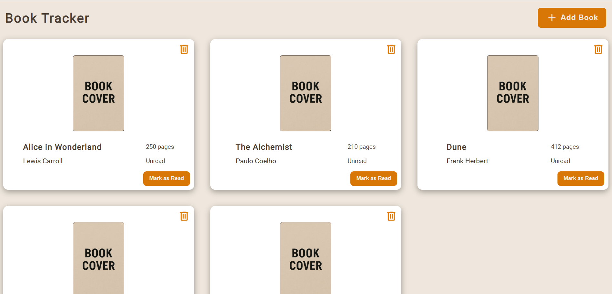
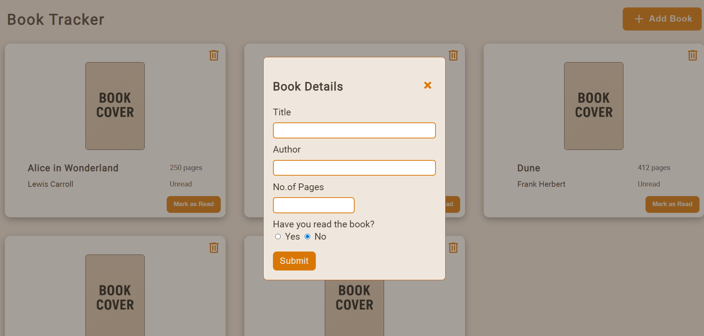

# Book Tracker

A simple web app to manage your book collection.

Live Demo: [https://sameeksha-dalvi.github.io/book-tracker/](https://sameeksha-dalvi.github.io/book-tracker/)

---

## Short Description

Track your books, mark read/unread, and manage your collection easily.

---

## How It Works

1. Books are stored in an array called `myTracker`.
2. Each book is an instance of the `Book` constructor, which holds its details and read status.
3. The `toggleReadStatus()` prototype function is used to switch a book between read and unread.
4. The app dynamically generates a card in the DOM for each book.
5. Each card has buttons for toggling read status and deleting the book from the collection.
6. The UI updates in real-time whenever a book is added, removed, or its status is changed.

---

## Screenshots

### Book List View

### Add New Book Form
